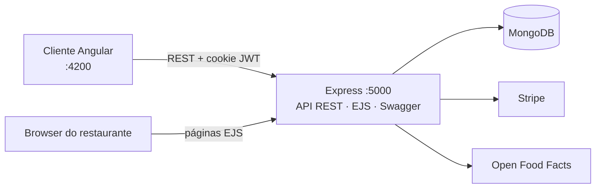

# Snackify – plataforma de encomendas a restaurantes

Aplicação web *full stack* onde restaurantes publicam menus e gerem encomendas, e clientes pesquisam restaurantes, montam o carrinho, encomendam e avaliam a refeição. Inclui API REST documentada com Swagger, *back-office* para os restaurantes, cliente Angular e pagamento de teste com Stripe.

Trabalho prático de grupo de **Programação em Ambiente Web** (2.º ano da Licenciatura em Engenharia Informática, ESTG – Politécnico do Porto, 2024/25), revisto em 2026.

[](https://github.com/fmpoliveira05-jpg/snackify/actions/workflows/ci.yml)

## Equipa

- Francisco Oliveira – [@fmpoliveira05-jpg](https://github.com/fmpoliveira05-jpg)
- franciscom0rais
- PedroIUrt3

O histórico de *commits* do repositório original do grupo foi mantido.

## O enunciado em poucas palavras

Uma plataforma para ajudar restaurantes a gerir pedidos e menus:

- registo e autenticação de clientes e restaurantes; um **administrador valida** cada restaurante antes de este poder operar;
- menus com **no máximo 10 pratos**, categorias, fotografias, informação nutricional e preço por dose;
- carrinho que **expira ao fim de 10 minutos**, cálculo do total e conclusão da encomenda (com notificação);
- o cliente pode **cancelar nos primeiros 5 minutos**, desde que a cozinha ainda não tenha começado; quem cancelar **5 encomendas num mês fica 2 meses sem poder encomendar**;
- o restaurante acompanha o estado de cada encomenda (em preparação, expedida, entregue);
- depois da entrega o cliente pode deixar um comentário com fotografia.

Obrigatório: Node.js + Express, MongoDB, EJS no primeiro *milestone*, Angular no cliente e serviços REST documentados com Swagger.

## Funcionalidades

| Cliente | Restaurante | Administrador |
|---|---|---|
| Pesquisa de restaurantes e menus | Criação e edição de pratos e menus | Validação e desativação de restaurantes |
| Carrinho com contagem decrescente | Informação nutricional automática ([Open Food Facts](https://world.openfoodfacts.org/)) | Gestão de categorias |
| Encomenda, pagamento no local ou com Stripe (modo de teste) | Pesquisa de menus por texto ou preço | |
| Cancelamento e avaliação de encomendas | Gráfico de encomendas por estado (Google Charts) | |
| Histórico e perfil | Gestão do estado das encomendas e leitura de avaliações | |

## Arquitetura



```
backend/
  app.js            configuração do Express (exportada para os testes)
  server.js         liga ao MongoDB e arranca o servidor
  config/           leitura e validação das variáveis de ambiente
  routes/           rotas + anotações Swagger
  controllers/      lógica de cada rota
  services/         regras de negócio puras (cancelamento, bloqueio, estados, totais)
  models/           esquemas Mongoose e validações
  middlewares/      autenticação, papéis, uploads, validação e erros
  views/ public/    back-office em EJS
  tests/            testes Jest + Supertest
frontend/           cliente Angular 19 (componentes standalone)
```

## Como executar

Requisitos: **Node.js 20+** e um **MongoDB** (local, em Docker ou no Atlas).

```bash
git clone https://github.com/fmpoliveira05-jpg/snackify.git
cd snackify

# 1. Base de dados (opcional, se não tiver um MongoDB)
docker compose up -d

# 2. API
cd backend
cp .env.example .env        # e preencher, sobretudo JWT_SECRET
npm install
npm run seed                # cria o administrador (admin / Admin#2025) e as categorias
npm run dev                 # http://localhost:5000  ·  Swagger em /api-docs

# 3. Cliente Angular (noutro terminal)
cd frontend
npm install
npm start                   # http://localhost:4200
```

Para experimentar o pagamento online é preciso uma chave de teste do Stripe (`sk_test_...`) no `.env` e usar o cartão de teste `4242 4242 4242 4242`. Sem chave, a aplicação funciona na mesma com pagamento no local.

O [manual de utilização](docs/MANUAL.md) descreve o percurso completo de cada tipo de utilizador.

## Testes

```bash
cd backend && npm test          # 47 testes: regras de negócio, uploads, autenticação e autorização
cd frontend && npm run test:ci  # 27 testes: serviços, guards e criação dos componentes
```

Os testes do backend não precisam de base de dados: as regras de negócio são funções puras e os testes da API usam *mocks* dos modelos. O GitHub Actions corre os dois conjuntos, compila o Angular em modo de produção e verifica se há dependências com vulnerabilidades conhecidas.

## Segurança: o que foi corrigido na revisão de 2026

A versão entregue funcionava, mas uma revisão com foco em segurança encontrou problemas sérios. Ficam aqui registados porque são exatamente o tipo de coisa que é fácil deixar passar num projeto académico:

- **Credenciais no repositório** – o ficheiro `.env` (ligação ao MongoDB Atlas, segredo JWT e chave do Stripe) estava no histórico do Git. Foi removido de todo o histórico e passou a existir um `.env.example`.
- **Escalada de privilégios** – o formulário de perfil aceitava qualquer campo, pelo que um cliente podia enviar `userType: "admin"`; e um restaurante podia registar-se já com `isChecked: true`, saltando a validação do administrador. Agora só são aceites campos explicitamente permitidos.
- **Acesso a dados de terceiros (IDOR)** – qualquer utilizador autenticado podia mudar o estado de qualquer encomenda, ver encomendas de outros clientes e editar ou apagar pratos de outros restaurantes. Todas estas operações verificam agora o dono do recurso.
- **Pagamentos** – os preços enviados ao Stripe vinham do browser e bastava abrir o URL de sucesso para marcar uma encomenda como paga. Agora os valores vêm da base de dados e a sessão é confirmada junto do Stripe.
- **Fuga de dados** – as listagens devolviam os *hashes* das passwords, o NIF e contas por validar. A password deixou de ser lida por omissão (`select: false`) e as respostas só incluem os campos necessários.
- **Injeção NoSQL e força bruta** – o login aceitava objetos como `{"$ne": null}` e não tinha limite de tentativas. Ativado o `sanitizeFilter` do Mongoose, validado o tipo dos campos e acrescentado *rate limiting*; a mensagem de erro deixou de revelar se o utilizador existe.
- **Uploads** – eram aceites ficheiros de qualquer tipo com o nome original (incluindo HTML servido a partir do domínio). Agora só imagens até 2 MB, com nome gerado pelo servidor.
- **Estabilidade** – um erro dentro de um controlador assíncrono (por exemplo, um id de prato inválido) terminava o processo Node. Todos os controladores passaram por um `asyncHandler` e há um *middleware* de erros central.

Também foram corrigidas regras de negócio: o bloqueio por cancelamentos desaparecia ao fim de um mês em vez de dois e não impedia novas encomendas; o limite de 10 pratos não era verificado ao editar um menu; era possível avaliar encomendas ainda não entregues e saltar estados da encomenda; o gráfico do restaurante contava as encomendas de todos os restaurantes; e as fotografias enviadas no registo ficavam guardadas numa pasta diferente daquela para onde apontava o link. No cliente Angular, os endereços da API deixaram de estar escritos em nove ficheiros e passaram para a configuração de ambiente.
