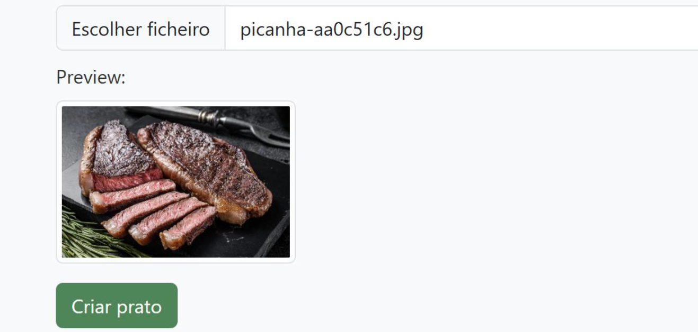
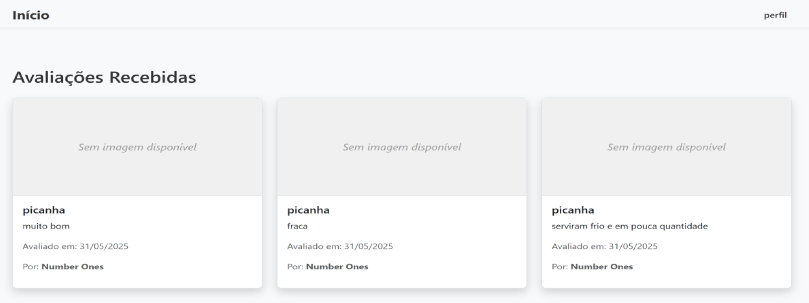
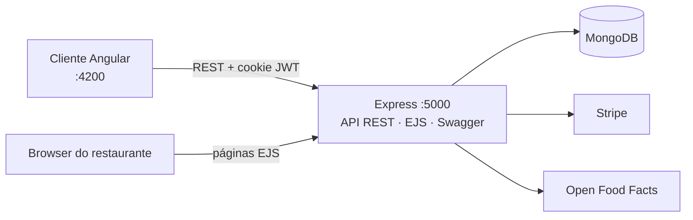

# Snackify – plataforma de encomendas a restaurantes

Aplicação web *full stack* onde restaurantes publicam menus e gerem encomendas, e clientes pesquisam restaurantes, montam o carrinho, encomendam e avaliam a refeição. Inclui API REST documentada com Swagger, *back-office* para os restaurantes, cliente Angular e pagamento de teste com Stripe.

Trabalho prático de grupo de **Programação em Ambiente Web** (2.º ano da Licenciatura em Engenharia Informática, ESTG – Politécnico do Porto, 2024/25), revisto em 2026.

[](https://github.com/fmpoliveira05-jpg/snackify/actions/workflows/ci.yml)

## Equipa

- Francisco Oliveira – [@fmpoliveira05-jpg](https://github.com/fmpoliveira05-jpg)
- franciscom0rais
- PedroIUrt3

O histórico de *commits* do repositório original do grupo foi mantido.

**O meu papel:** montei a estrutura inicial e o modelo de dados, e fiquei com o registo e a autenticação, a gestão de menus e a validação de restaurantes pelo administrador; integrei a Open Food Facts, o pagamento com Stripe e os gráficos dos painéis (Google Charts), e arranquei o cliente Angular. Depois da entrega, em 2026, fiz a revisão de segurança, os testes e as funcionalidades que tinham ficado por fazer (descritas no fim).

## O enunciado em poucas palavras

Uma plataforma para ajudar restaurantes a gerir pedidos e menus:

- registo e autenticação de clientes e restaurantes; um **administrador valida** cada restaurante antes de este poder operar;
- menus com **no máximo 10 pratos**, categorias, fotografias, informação nutricional e preço por dose;
- carrinho que **expira ao fim de 10 minutos**, cálculo do total e conclusão da encomenda (com notificação);
- o cliente pode **cancelar nos primeiros 5 minutos**, desde que a cozinha ainda não tenha começado; quem cancelar **5 encomendas num mês fica 2 meses sem poder encomendar**;
- o restaurante acompanha o estado de cada encomenda (em preparação, expedida, entregue);
- depois da entrega o cliente pode deixar um comentário com fotografia.

Obrigatório: Node.js + Express, MongoDB, EJS no primeiro *milestone*, Angular no cliente e serviços REST documentados com Swagger.

## Funcionalidades

| Cliente | Restaurante | Administrador |
|---|---|---|
| Pesquisa de restaurantes (nome, localidade/distrito) e de pratos (texto, categoria, restaurante, localização, preço) com ordenação | Criação e edição de pratos e menus (máx. 10 pratos) | Validação e desativação de restaurantes |
| Página de cada prato com imagem, categoria, Nutri-Score, calorias e alergénios | Informação nutricional automática ([Open Food Facts](https://world.openfoodfacts.org/)) | Gestão de categorias |
| Carrinho com contagem decrescente de 10 minutos | Tempos de preparação e de entrega, raio máximo de entrega e limite de encomendas em curso | |
| Entrega, levantamento ou consumo no restaurante; pagamento online (Stripe, modo de teste) ou no local com código + documento de identificação | Aviso de novas encomendas (no perfil e no *back-office*) | |
| Vales de refeição: comprar para si ou oferecer a outro cliente e usar o saldo nas encomendas | Gestão do estado das encomendas e leitura de avaliações | |
| Cancelamento, avaliação com foto, histórico e perfil | Gráfico de encomendas por estado (Google Charts) | |

Funcionalidades de bonificação do enunciado: gráficos nos *dashboards* ✔, pagamento com API externa (Stripe) ✔, carrinho de 10 minutos com contador ✔, vales de refeição ✔ e Open Food Facts ✔.

### Capturas de ecrã

| Criar um prato (*back-office* do restaurante) | Avaliações recebidas pelo restaurante |
|---|---|
|  |  |

## Arquitetura


```mermaid
flowchart LR
    C[Cliente Angular<br/>:4200] -- REST + cookie JWT --> A
    R[Browser do restaurante] -- páginas EJS --> A
    A[Express :5000<br/>API REST · EJS · Swagger] --> M[(MongoDB)]
    A --> S[Stripe]
    A --> O[Open Food Facts]
```

```
backend/
  app.js            configuração do Express (exportada para os testes)
  server.js         liga ao MongoDB e arranca o servidor
  config/           leitura e validação das variáveis de ambiente
  routes/           rotas + anotações Swagger
  controllers/      lógica de cada rota
  services/         regras de negócio (cancelamento, bloqueio, estados, totais, restaurante,
                    pesquisa, vales, pagamentos, lugares, cache, RGPD e limpeza)
  models/           esquemas Mongoose e validações
  middlewares/      autenticação, papéis, uploads, validação e erros
  views/ public/    back-office em EJS
  tests/            testes Jest + Supertest (sem base de dados)
  tests-integracao/ testes contra um MongoDB real (concorrência, RGPD, explain)
  tests-navegador/  teste num Chromium real (armazenamento do browser e cookies)
frontend/           cliente Angular 20 (componentes standalone)
scripts/            cópias de segurança e restauro do MongoDB (e o teste do restauro)
docs/               manual, operação, RGPD e custos
```

## Como executar

Requisitos: **Node.js 20+** e um **MongoDB** (local, em Docker ou no Atlas).

```bash
git clone https://github.com/fmpoliveira05-jpg/snackify.git
cd snackify

# 1. Base de dados (opcional, se não tiver um MongoDB)
cp .env.example .env        # definir MONGO_ROOT_PASSWORD
docker compose up -d        # MongoDB só em 127.0.0.1:27017, com autenticação

# 2. API
cd backend
cp .env.example .env        # e preencher, sobretudo JWT_SECRET e MONGODB_URI
npm install
npm run seed                # cria o administrador (password de ADMIN_PASSWORD ou gerada) e as categorias
npm run dev                 # http://localhost:5000  ·  Swagger em /api-docs

# 3. Cliente Angular (noutro terminal)
cd frontend
npm install
npm start                   # http://localhost:4200
```

Com o `docker-compose.yml`, a ligação no `backend/.env` é `MONGODB_URI=mongodb://snackify:<MONGO_ROOT_PASSWORD>@127.0.0.1:27017/snackify?authSource=admin`.

Para experimentar o pagamento online é preciso uma chave de teste do Stripe (`sk_test_...`) no `.env` e usar o cartão de teste `4242 4242 4242 4242`. Sem chave, a aplicação funciona na mesma com pagamento no local (os vales precisam do Stripe ou, só em desenvolvimento, de `ALLOW_SIMULATED_PAYMENTS=true`).

Depois do registo é preciso confirmar o email. Sem SMTP configurado, em desenvolvimento o link aparece na consola do backend.

O [manual de utilização](docs/MANUAL.md) descreve o percurso completo de cada tipo de utilizador.

## Testes

```bash
cd backend
npm test                   # 243 testes sem base de dados: regras, API, segurança, cache, limites, RGPD, erros
npm run test:integracao    # 39 testes contra um MongoDB real em Docker: concorrência, RGPD, explain()
npm run test:navegador     # Chromium real: armazenamento do browser e cookies (precisa do build do Angular)
npm run carga              # teste de carga com autocannon (ver docs/OPERACAO.md)
cd ../frontend && npm run test:ci   # 59 testes: serviços, guards, componentes, interceptor e estados
scripts/testar-backup-restauro.sh   # cópia de segurança, restauro e comparação dos dados
```

Os testes de integração, do browser e de carga arrancam um `mongo:7` descartável em Docker (dados em
memória, removido no fim); com `MONGO_TEST_URI` usam um MongoDB já existente. O GitHub Actions corre
os testes unitários, os de integração (com um contentor MongoDB), compila o Angular em modo de
produção e confirma que não há *source maps*, corre o `npm audit` e procura segredos no histórico
com o gitleaks.

## Operação

Pormenores em [docs/OPERACAO.md](docs/OPERACAO.md).

- **Saúde**: `GET /health/live` (processo) e `GET /health/ready` (MongoDB), sem segredos e fora dos
  limites de pedidos.
- **Monitorização**: `.github/workflows/uptime.yml` verifica `SNACKIFY_HEALTH_URL` (variável do
  repositório) a cada 15 minutos e abre uma issue se falhar; sem a variável não faz nada. Como alarme
  principal, UptimeRobot ou Better Stack.
- **Cópias de segurança**: `scripts/backup.sh` (mongodump comprimido, com data e hora, `.sha256`,
  retenção de `BACKUP_KEEP` cópias, cifra opcional com age ou GPG) e `scripts/restore.sh`.
  `scripts/testar-backup-restauro.sh` prova que a cópia repõe exatamente os mesmos dados.
- **Carga**: `npm run carga` — 100 ligações durante 20 s em cada cenário, sem erros (resultados em
  docs/OPERACAO.md).
- **Encerramento e tempos máximos**: `SIGTERM` termina os pedidos em curso e fecha o MongoDB; o
  servidor, o MongoDB, o Stripe, o SMTP e o Angular têm tempos máximos.
- **Índices**: `npm run indices` depois de um deploy que mude índices.
- **Limpeza (RGPD)**: tarefa de hora a hora; `npm run limpeza` corre-a uma vez.
- **Erros**: página 404 no Angular e no back-office, 404 em JSON na API, página 500 sem pormenores.
- **Cache**: catálogo e Open Food Facts em memória, ficheiros do Angular com cache de um ano,
  `no-store` na API.

## Limites

Todos configuráveis no `backend/.env` (valores por omissão):

| Limite | Valor | Variável |
|---|---|---|
| Pedidos à API por IP | 300 / 15 min | `RATE_LIMIT_API_MAX`, `RATE_LIMIT_API_WINDOW_MINUTES` |
| Login por IP | 20 / 15 min | `RATE_LIMIT_LOGIN_MAX` |
| Registos por IP | 10 / hora | `RATE_LIMIT_REGISTER_PER_HOUR` |
| Recuperação da password / reenvio da confirmação por IP | 5 / hora | — |
| Encomendas por conta | 20 / hora | `QUOTA_ORDERS_PER_HOUR` |
| Pagamentos e compras de vales por conta | 30 / hora | `QUOTA_PAYMENTS_PER_HOUR` |
| Uploads por conta | 30 / hora | `QUOTA_UPLOADS_PER_HOUR` |
| Pratos criados/editados por conta (Open Food Facts) | 60 / hora | `QUOTA_DISH_WRITES_PER_HOUR` |
| Exportações de dados por conta | 5 / dia | `QUOTA_EXPORTS_PER_DAY` |
| Pedidos à Open Food Facts (instância) | 10 / minuto | `OFF_MAX_REQUESTS_PER_MINUTE` |
| Emails (instância / por destinatário) | 300 / 5 por dia | `MAIL_MAX_PER_DAY`, `MAIL_MAX_PER_ADDRESS_PER_DAY` |
| Corpo JSON/formulário | 100 KB | — |
| Imagem | 1 ficheiro, 2 MB (JPG, PNG, WEBP, GIF) | — |
| Páginas das listas | 50 por omissão, máximo 100 (`?pagina=&limite=`, total em `X-Total-Count`) | — |

Acima do limite a resposta é `429` com cabeçalhos `RateLimit-*`. O webhook do Stripe e as
verificações de saúde não contam. Os contadores são por instância. Como pôr alertas e tetos de
gastos nos serviços pagos: [docs/CUSTOS.md](docs/CUSTOS.md).

## RGPD

Pormenores, registo das atividades de tratamento (art. 30.º), segurança (art. 32.º) e procedimento
em caso de violação de dados (art. 33.º/34.º, 72 h) em [docs/RGPD.md](docs/RGPD.md).

- **Política de Privacidade** em `/privacidade` (rodapé do Angular, barra do back-office e registo),
  com responsável, dados, finalidades, fundamentos, prazos, subcontratantes, transferências,
  direitos e reclamação à CNPD.
- **Registo**: caixa da política obrigatória e nunca pré-marcada; ficam guardadas a versão
  (`PRIVACY_POLICY_VERSION`) e a data da aceitação. Não há marketing, por isso não há outro consentimento.
- **Acesso e portabilidade**: "Descarregar os meus dados" no perfil (`GET /user/perfil/exportar`, JSON).
- **Apagamento**: "Apagar conta" no perfil, com a password (`POST /user/perfil/eliminar`); as
  encomendas ficam pseudonimizadas pela obrigação legal de conservar os documentos de venda.
- **Retificação**: "Editar perfil".
- **Conservação**: contas por confirmar apagadas ao fim de 7 dias (e índice TTL), tokens expirados
  removidos, documento de identificação das encomendas apagado 30 dias depois, vales nunca pagos
  apagados ao fim de 2 dias.
- **Cookies**: só o cookie da sessão (estritamente necessário, sem banner); nada no `localStorage`;
  Bootstrap e tipo de letra servidos pelo próprio servidor; Google Charts só na página do gráfico.

## Segurança: o que foi corrigido na revisão de 2026

A versão entregue funcionava, mas uma revisão com foco em segurança encontrou problemas sérios. Ficam aqui registados porque são exatamente o tipo de coisa que é fácil deixar passar num projeto académico:

- **Credenciais no repositório** – o ficheiro `.env` (ligação ao MongoDB Atlas, segredo JWT e chave do Stripe) estava no histórico do Git. Foi removido de todo o histórico e passou a existir um `.env.example`.
- **Escalada de privilégios** – o formulário de perfil aceitava qualquer campo, pelo que um cliente podia enviar `userType: "admin"`; e um restaurante podia registar-se já com `isChecked: true`, saltando a validação do administrador. Agora só são aceites campos explicitamente permitidos.
- **Acesso a dados de terceiros (IDOR)** – qualquer utilizador autenticado podia mudar o estado de qualquer encomenda, ver encomendas de outros clientes e editar ou apagar pratos de outros restaurantes. Todas estas operações verificam agora o dono do recurso.
- **Pagamentos** – os preços enviados ao Stripe vinham do browser e bastava abrir o URL de sucesso para marcar uma encomenda como paga. Agora os valores vêm da base de dados e a sessão é confirmada junto do Stripe.
- **Fuga de dados** – as listagens devolviam os *hashes* das passwords, o NIF e contas por validar. A password deixou de ser lida por omissão (`select: false`) e as respostas só incluem os campos necessários.
- **Injeção NoSQL e força bruta** – o login aceitava objetos como `{"$ne": null}` e não tinha limite de tentativas. Ativado o `sanitizeFilter` do Mongoose, validado o tipo dos campos e acrescentado *rate limiting*; a mensagem de erro deixou de revelar se o utilizador existe.
- **Uploads** – eram aceites ficheiros de qualquer tipo com o nome original (incluindo HTML servido a partir do domínio). Agora só imagens até 2 MB, com nome gerado pelo servidor.
- **Estabilidade** – um erro dentro de um controlador assíncrono (por exemplo, um id de prato inválido) terminava o processo Node. Todos os controladores passaram por um `asyncHandler` e há um *middleware* de erros central.

Também foram corrigidas regras de negócio: o bloqueio por cancelamentos desaparecia ao fim de um mês em vez de dois e não impedia novas encomendas; o limite de 10 pratos não era verificado ao editar um menu; era possível avaliar encomendas ainda não entregues e saltar estados da encomenda; o gráfico do restaurante contava as encomendas de todos os restaurantes; e as fotografias enviadas no registo ficavam guardadas numa pasta diferente daquela para onde apontava o link. No cliente Angular, os endereços da API deixaram de estar escritos em nove ficheiros e passaram para a configuração de ambiente.

## Segurança: configuração e segunda revisão

Uma segunda revisão acrescentou as proteções abaixo. Todas as variáveis estão descritas em `backend/.env.example`.

- **Sessão** – o JWT (HS256, com emissor, público, `jti` e versão da conta) vive só num cookie `HttpOnly`, `SameSite=Strict` e `Secure` em produção, com o nome `__Host-snackify` (em desenvolvimento, `token`). Nunca é devolvido no corpo nem aceite no cabeçalho `Authorization`. Redefinir a password ou usar `POST /auth/logout-all` invalida todas as sessões abertas. Em produção, `JWT_SECRET` tem de ter pelo menos 32 caracteres.
- **CSRF** – os pedidos `POST/PUT/PATCH/DELETE` só são aceites com `Origin` (ou `Referer`) igual a `CLIENT_URL` ou `SERVER_URL`.
- **Contas** – o email tem de ser confirmado antes do primeiro login; há recuperação da password (link de 30 minutos e uso único); após 5 tentativas falhadas a conta fica bloqueada 15 minutos; todas as falhas de login dão a mesma mensagem. Passwords com 10 a 64 caracteres, maiúscula, minúscula, número e símbolo (bcrypt com custo 12). Os tokens enviados por email só são guardados como *hash* SHA-256.
- **Vales pagos a sério** – comprar um vale cria-o pendente e sem saldo; só fica ativo quando o Stripe confirma o pagamento (no regresso ou pelo webhook). Antes, a compra "simulada" dava saldo real sem pagar.
- **Bots e abusos** – limites de pedidos por IP (login, registo, recuperação, reenvio, verificação e um limite geral da API), campo *honeypot* e Cloudflare Turnstile no registo, login e recuperação.
- **Cabeçalhos** – CSP com *nonce* por pedido (sem scripts nem atributos de evento inline), `X-Frame-Options: DENY`, `Referrer-Policy`, `Permissions-Policy`, HSTS e redirecionamento para HTTPS em produção; limite de 100 KB nos corpos JSON/formulários; Swagger fechado em produção.
- **Uploads** – o tipo real da imagem é confirmado pelos primeiros bytes (JPEG, PNG, WEBP, GIF) e a extensão é a do tipo detetado; os ficheiros são servidos com `nosniff` e CSP `sandbox`.
- **Erros** – nenhuma resposta inclui mensagens internas; os registos não incluem query strings, tokens nem passwords.
- **Consultas** – os operadores construídos pelo servidor (`$gt`, `$in`, ...) passaram a ser marcados como confiáveis: o `sanitizeFilter` estava a neutralizá-los, o que desligava o limite de encomendas em curso, o bloqueio por cancelamentos e a pesquisa de pratos.
- **Dependências** – Angular atualizado para a versão 20 (vulnerabilidades XSS) e removida a dependência `mongoose-validator`, sem uso.

### Como configurar

- **Email (SMTP)** – defina `SMTP_HOST`, `SMTP_PORT` (587 com STARTTLS ou 465 com `SMTP_SECURE=true`), `SMTP_USER`, `SMTP_PASS` e `MAIL_FROM`. Sem SMTP, fora de produção o email é escrito na consola; em produção o envio falha e fica registado sem o link.
- **Webhook do Stripe** – em desenvolvimento, com a [Stripe CLI](https://docs.stripe.com/stripe-cli):
  ```bash
  stripe listen --forward-to localhost:5000/api/stripe/webhook
  ```
  e copie o `whsec_...` apresentado para `STRIPE_WEBHOOK_SECRET`. Em produção, crie o endpoint `https://<domínio>/api/stripe/webhook` no painel do Stripe com o evento `checkout.session.completed`. Sem o segredo, o webhook responde 503 e o pagamento é confirmado apenas no regresso do cliente.
- **Cloudflare Turnstile** – crie um *widget* no painel da Cloudflare; a chave secreta vai para `TURNSTILE_SECRET_KEY`, a pública para `TURNSTILE_SITE_KEY` (formulários EJS) e para `turnstileSiteKey` em `frontend/src/environments/*.ts`. Com a chave secreta vazia, a verificação fica desligada.
- **Administrador** – defina `ADMIN_PASSWORD` (tem de cumprir a regra das passwords) antes de `npm run seed`; sem ela é gerada uma password aleatória, mostrada só fora de produção. As contas criadas pelo seed ficam com o email confirmado.
- **`ALLOW_SIMULATED_PAYMENTS=true`** – só para desenvolvimento: permite comprar vales sem pagar. É sempre ignorada com `NODE_ENV=production`.
- **`ENABLE_API_DOCS=true`** – publica o Swagger em produção (fora de produção está sempre disponível).
- **`TRUST_PROXY`** – número de proxies à frente da aplicação (ex.: `1` atrás de Nginx ou Render). Sem isto, atrás de um proxy, os limites por IP e o redirecionamento para HTTPS não funcionam corretamente.

### Migração de dados existentes

Contas criadas antes desta versão não têm o email confirmado e não conseguem entrar. Depois de rever a lista, marque-as como confirmadas no `mongosh`:

```js
db.users.updateMany({ emailVerified: { $exists: false } }, { $set: { emailVerified: true } })
db.restaurants.updateMany({ emailVerified: { $exists: false } }, { $set: { emailVerified: true } })
```

Os vales antigos não têm estado e deixam de poder ser usados (foram criados sem pagamento). Se algum for legítimo, ative-o com `db.vouchers.updateOne({ code: "VALE-..." }, { $set: { status: "active" } })`.

## O que faltava face ao enunciado (acrescentado em 2026)

- **Definições do restaurante** – tempos de preparação e de entrega, raio máximo de entrega e número máximo de encomendas em curso. São aplicados ao criar a encomenda (o raio é calculado pela fórmula de haversine quando há coordenadas nas moradas) e dão a hora prevista de preparação e de entrega.
- **Pesquisa, filtros e ordenação** para clientes, por nome, categoria, preço, restaurante e localização.
- **Pagamento no local** com o código da encomenda e um documento de identificação, que fica associado à encomenda e é visível para o restaurante.
- **Notificação no lado do restaurante** quando chega uma encomenda nova.
- **Vales de refeição** (bonificação), com saldo que é devolvido se a encomenda for cancelada.
